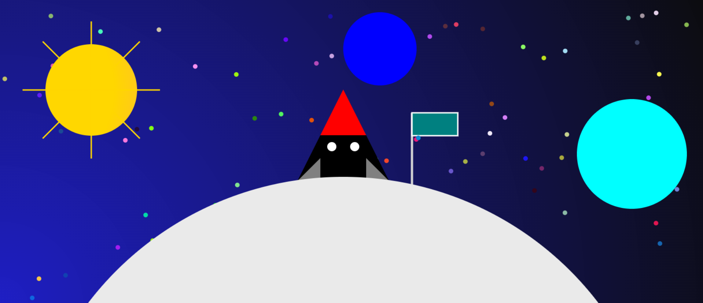
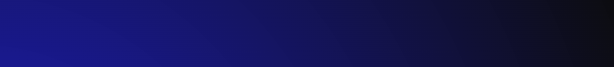
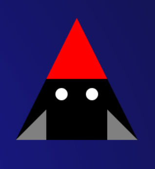
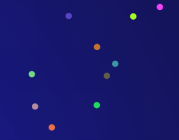
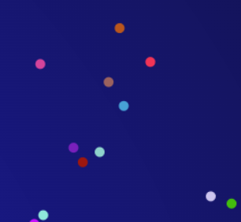
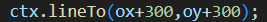

= Compte rendu : _Projet Virtual landscape-master_
:toc-title: Tables des matières
:toc: top

Projet réalisé par : +
*SONG* Steeven +

Du 20/03/2023 au 14/05/2023

== *Contexte :* +
----
Dans le cadre de mon projet Virtual landscape-master, l'objectif était de nous permettre d'apprendre à utiliser une petite application javascript sans framework (canvas) afin de mettre en avant notre créativité pour reussir ce projet.
----

<<<<

===  *Introduction :* +
----
J'ai avant tout appris les bases de canvas afin de me faire une idée de comment utiliser l'application. Ensuite j'ai reflechis sur mon thème et je me dirige finalement vers le thème de l'espace. Pourquoi ? Car ce theme utilise principalement les bases de canvas qui me permet donc de consolider les bases sans non plus poussé le projet trop loin.
----

IMPORTANT: Lien GitLab : https://gitlab.com/SteevenSong/Virtual.git

== *I. Creation du projet* +

=== *a) Présentation du projet* +

Mon projet illustre les premiers pas de l'homme sur la Lune, on y trouve la Lune en première plan ainsi qu'une fusée et un drapeau. Pour ajouter des détails je suis parti sur une base de plusieurs cercles pour décrire l'environnement en arrière plan, comme deux planète dont la Terre et Neptune ainsi que l'étoile principal qui est le soleil et plusieurs petit étoiles aléatoire.

=== *b). L'arrière plan du dessin* +

Tout d'abord, avant de commencer à réaliser des formes, je dois me décider sur l'arrière plan de mon projet.
J'ai opté pour un bleu foncé avec un léger dégradé noir afin d'être dans le thème de l'espace.

[source,css]
----
background: radial-gradient( farthest-corner circle at left bottom, rgba(7, 7, 190, 0.907), #020202f5);
----

=== *c). Mise en forme du projet* +

[source,js]
import { AbstractForm } from './AbstractForm.js';
constructor(
    x = 0,
    y = 0,
    width = 0,
    height = 0,
    fillColor = '',
    strokeColor = '',
    strokeWidth = 2,
    pesenteur = false,
    ordreConstruction = 100
  ) {
    super(x, y, width, height, fillColor, strokeColor, strokeWidth, pesenteur, ordreConstruction)
  }

Mon projet sera constitué d'une classe de forme herite de AbstractForm ainsi qu'un constructeur avec plusieurs attributs pour définir des valeurs.

L'ensemble de mon projet est composé de divers forme géometrique (carré, triangle et cercle).

Voici un exemple qui illustre l'ensemble du projet.

[source,js]
    ctx.beginPath();
    ctx.moveTo(ox+100,oy+300);
    ctx.lineTo(ox+150,oy+200);
    ctx.lineTo(ox+250,oy+200);
    ctx.lineTo(ox+300,oy+300);
    ctx.closePath();
    ctx.fillStyle = 'black';
    ctx.fill();
//corps de la fusée

[source,js]
    ctx.beginPath();
    ctx.arc(ox + 175, oy + 225, 10, 0, Math.PI * 2);
    ctx.fillStyle = 'white';
    ctx.fill();
//fenetre de la fusée

J'ai aussi ajouté des placements et des couleurs aléatoire pour mes formes.

Pour les étoiles, ils ne seront jamais à un placement et une couleur fixe.

[source,js]

    ctx.beginPath();
for ( var i = 0; i<=Math.random()*40000; i++) {
      let r = Math.round(Math.random() * 255)
      let g = Math.round(Math.random() * 255)
      let b = Math.round(Math.random() * 255)

[source,js]
      let rgb = `rgb(${r}, ${g}, ${b})`

[source,js]
    ctx.arc(ox +Math.random()*1500, oy +Math.random()*1500, 5, 0, Math.PI * 2, true);
    ctx.fillStyle = rgb
    ctx.fill()
    ctx.beginPath();
    }

IMPORTANT: Math.random défini de façon aléatoire l'emplacement et la couleur de la forme en fonction du nombre indiqué.

=== *d) Difficulté rencontrer* +

J'ai mis beaucoup de temps a visualiser le concept de ordonnée et abscisse ce qui m'a beaucoup ralenti pour la création de mes formes geométrique.

== *II. Conclusion* +
Le projet nous a permi d'apprendre à developper notre creativité à travers l'application canvas, d'apprendre une nouvelle application sans framework.

Mais de façon général, je n'ai pas trouver le projet intéressant comparé à celui de géoworld. Globalement ce projet est assez répétitif c'est à dire qu'on retrouve principalement les même bases (geométrique), ce qui rend peu attractif le projet.

